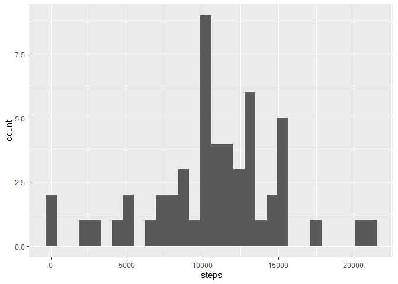
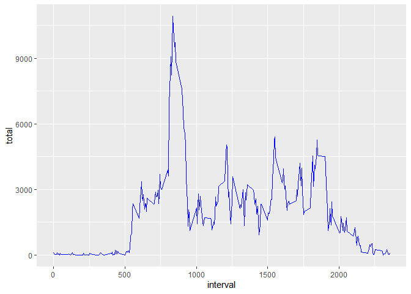

# Reproducible Research, Course Project 1

While typically this would be written with the language "include=FALSE" so that you would not be able to see it, this function applies to the entire project and ensures that code is printed as well as results.


```r
knitr::opts_chunk$set(echo = TRUE)
```

## Contents
- [Loading and preprocessing the data](#loading-and-preprocessing-the-data)
- [What is mean total number of steps taken per day?](#What-is-mean-total-number-of-steps-taken-per-day)
- [What is the average daily activity pattern?](#What-is-the-average-daily-activity-pattern)
- [Imputing missing values](#imputing-missing-values)
- [Are there differences in activity patterns between weekdays and weekends?](#Are-there-differences-in-activity-patterns-between-weekdays-and-weekends)

## Loading and preprocessing the data

>Show any code that is needed to:
>1. Load the data (i.e., ```read.csv()```)
>2. Process/transform the data (if necessary) into a format suitable for your analysis

The data is presented in a *.zip file, so we'll immediately unzip that and store it in "/data", than take a look at what kind of data we're dealing with.


```r
unzip("activity.zip",exdir = "./data")
dir("./data")
```

```
## [1] "activity.csv"
```

As it's a *.csv, it'll be reasonably easy to read in and take a look at.


```r
activity = read.csv("./data/activity.csv")
head(activity)
```

```
##   steps       date interval
## 1    NA 2012-10-01        0
## 2    NA 2012-10-01        5
## 3    NA 2012-10-01       10
## 4    NA 2012-10-01       15
## 5    NA 2012-10-01       20
## 6    NA 2012-10-01       25
```

We'll need to convert the date column to actual dates. Additionally, I'd love to get a summary, as the NA figures in "steps" worries me a bit.


```r
activity$date = as.Date(activity$date, "%Y-%m-%d")
summary(activity)
```

```
##      steps             date               interval     
##  Min.   :  0.00   Min.   :2012-10-01   Min.   :   0.0  
##  1st Qu.:  0.00   1st Qu.:2012-10-16   1st Qu.: 588.8  
##  Median :  0.00   Median :2012-10-31   Median :1177.5  
##  Mean   : 37.38   Mean   :2012-10-31   Mean   :1177.5  
##  3rd Qu.: 12.00   3rd Qu.:2012-11-15   3rd Qu.:1766.2  
##  Max.   :806.00   Max.   :2012-11-30   Max.   :2355.0  
##  NA's   :2304
```
As the next step allows us to ignore the missing values, I'm reasonably happy with what we're looking at for the time being.

## What is mean total number of steps taken per day?

>For this part of the assignment, you can ignore the missing values in the dataset.

We'll just create a separate set without the missing values, then:


```r
actign = activity[complete.cases(activity),]
sum(is.na(actign))
```

```
## [1] 0
```

>1. Calculate the total number of steps taken per day

This is straightforward.


```r
mean(activity$steps[complete.cases(activity$steps)])
```

```
## [1] 37.3826
```

>2. Make a histogram of the total number of steps taken each day

Will create a histogram using ggplot2:


```r
stepsday = aggregate(actign$steps, by=list(actign$date), sum)
names(stepsday) = c("date","steps")
ggplot(data = stepsday, aes(x=steps)) + geom_histogram()
```

```
## `stat_bin()` using `bins = 30`. Pick better value with `binwidth`.
```

<!-- -->

>3. Calculate and report the mean and median of the total number of steps taken per day


```r
mean(stepsday$steps)
```

```
## [1] 10766.19
```

```r
median(stepsday$steps)
```

```
## [1] 10765
```

## What is the average daily activity pattern?

>1. Make a time series plot (i.e. ```type = "l"```) of the 5-minute interval (x-axis) and the average number of steps taken, averaged across all days (y-axis)

This is similar to [the above question](#What-is-mean-total-number-of-steps-taken-per-day), but requires aggregation along interval, rather than day. Just for the sake of variety, I'll use dplyr here, rather than base r. We'll start again from the na filtered data set to do so:


```
## 
## Attaching package: 'dplyr'
```

```
## The following objects are masked from 'package:stats':
## 
##     filter, lag
```

```
## The following objects are masked from 'package:base':
## 
##     intersect, setdiff, setequal, union
```

```r
stepsint =  actign %>% group_by(interval) %>% summarise(total = sum(steps))
ggplot(stepsint, aes(y = total, x = interval)) + geom_line(color = "blue")
```

<!-- -->

>Which 5-minute interval, on average across all the days in the dataset, contains the maximum number of steps?


```r
stepsint[which.max(stepsint$total),]
```

```
## # A tibble: 1 × 2
##   interval total
##      <int> <int>
## 1      835 10927
```

Looks like interval 835.

## Imputing missing values


## Are there differences in activity patterns between weekdays and weekends?
