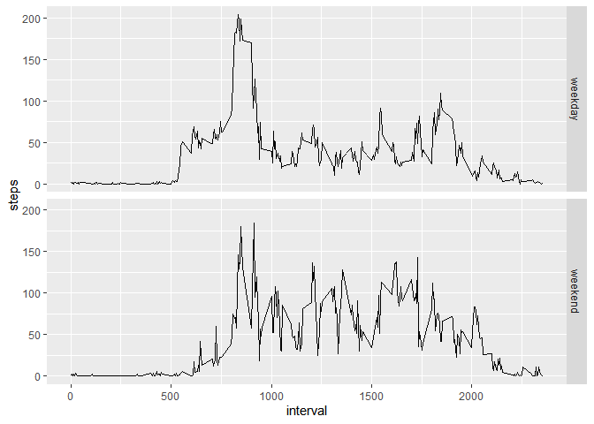

# Reproducible Research, Course Project 1

While typically this would be written with the language "include=FALSE" so that you would not be able to see it, this function applies to the entire project and ensures that code is printed as well as results.


```r
knitr::opts_chunk$set(echo = TRUE)
```

## Contents
- [Loading and preprocessing the data](#loading-and-preprocessing-the-data)
- [What is mean total number of steps taken per day?](#What-is-mean-total-number-of-steps-taken-per-day)
- [What is the average daily activity pattern?](#What-is-the-average-daily-activity-pattern)
- [Imputing missing values](#imputing-missing-values)
- [Are there differences in activity patterns between weekdays and weekends?](#Are-there-differences-in-activity-patterns-between-weekdays-and-weekends)

## Loading and preprocessing the data

>Show any code that is needed to:
>1. Load the data (i.e., ```read.csv()```)
>2. Process/transform the data (if necessary) into a format suitable for your analysis

The data is presented in a *.zip file, so we'll immediately unzip that and store it in "/data", than take a look at what kind of data we're dealing with.


```r
unzip("activity.zip",exdir = "./data")
dir("./data")
```

```
## [1] "activity.csv"
```

As it's a *.csv, it'll be reasonably easy to read in and take a look at.


```r
activity = read.csv("./data/activity.csv")
head(activity)
```

```
##   steps       date interval
## 1    NA 2012-10-01        0
## 2    NA 2012-10-01        5
## 3    NA 2012-10-01       10
## 4    NA 2012-10-01       15
## 5    NA 2012-10-01       20
## 6    NA 2012-10-01       25
```

We'll need to convert the date column to actual dates. Additionally, I'd love to get a summary, as the NA figures in "steps" worries me a bit.


```r
activity$date = as.Date(activity$date, "%Y-%m-%d")
summary(activity)
```

```
##      steps             date               interval     
##  Min.   :  0.00   Min.   :2012-10-01   Min.   :   0.0  
##  1st Qu.:  0.00   1st Qu.:2012-10-16   1st Qu.: 588.8  
##  Median :  0.00   Median :2012-10-31   Median :1177.5  
##  Mean   : 37.38   Mean   :2012-10-31   Mean   :1177.5  
##  3rd Qu.: 12.00   3rd Qu.:2012-11-15   3rd Qu.:1766.2  
##  Max.   :806.00   Max.   :2012-11-30   Max.   :2355.0  
##  NA's   :2304
```
As the next step allows us to ignore the missing values, I'm reasonably happy with what we're looking at for the time being.

## What is mean total number of steps taken per day?

>For this part of the assignment, you can ignore the missing values in the dataset.

We'll just create a separate set without the missing values, then:


```r
actign = activity[complete.cases(activity),]
sum(is.na(actign))
```

```
## [1] 0
```

>1. Calculate the total number of steps taken per day

This is straightforward.


```r
mean(activity$steps[complete.cases(activity$steps)])
```

```
## [1] 37.3826
```

>2. Make a histogram of the total number of steps taken each day

Will create a histogram using ggplot2:


```r
library(ggplot2)
stepsday = aggregate(actign$steps, by=list(actign$date), sum)
names(stepsday) = c("date","steps")
ggplot(data = stepsday, aes(x=steps)) + geom_histogram()
```

```
## `stat_bin()` using `bins = 30`. Pick better value with `binwidth`.
```

<!-- -->

>3. Calculate and report the mean and median of the total number of steps taken per day


```r
mean(stepsday$steps)
```

```
## [1] 10766.19
```

```r
median(stepsday$steps)
```

```
## [1] 10765
```

## What is the average daily activity pattern?

>1. Make a time series plot (i.e. ```type = "l"```) of the 5-minute interval (x-axis) and the average number of steps taken, averaged across all days (y-axis)

This is similar to [the above question](#What-is-mean-total-number-of-steps-taken-per-day), but requires aggregation along interval, rather than day. Just for the sake of variety, I'll use dplyr here, rather than base r. We'll start again from the na filtered data set to do so:


```r
library(dplyr)
```

```
## 
## Attaching package: 'dplyr'
```

```
## The following objects are masked from 'package:stats':
## 
##     filter, lag
```

```
## The following objects are masked from 'package:base':
## 
##     intersect, setdiff, setequal, union
```

```r
stepsign =  actign %>% group_by(interval) %>% summarise(totalign = sum(steps))
ggplot(stepsign, aes(y = totalign, x = interval)) + geom_line(color = "blue")
```

<!-- -->

>Which 5-minute interval, on average across all the days in the dataset, contains the maximum number of steps?


```r
stepsign[which.max(stepsign$total),]
```

```
## Warning: Unknown or uninitialised column: `total`.
```

```
## # A tibble: 0 × 2
## # … with 2 variables: interval <int>, totalign <int>
## # ℹ Use `colnames()` to see all variable names
```

Looks like interval 835.

## Imputing missing values

> 1. Calculate and report the total number of missing values in the dataset (i.e. the total number of rows with _NA_s.

This can be done with a simple summary:


```r
summary(activity)
```

```
##      steps             date               interval     
##  Min.   :  0.00   Min.   :2012-10-01   Min.   :   0.0  
##  1st Qu.:  0.00   1st Qu.:2012-10-16   1st Qu.: 588.8  
##  Median :  0.00   Median :2012-10-31   Median :1177.5  
##  Mean   : 37.38   Mean   :2012-10-31   Mean   :1177.5  
##  3rd Qu.: 12.00   3rd Qu.:2012-11-15   3rd Qu.:1766.2  
##  Max.   :806.00   Max.   :2012-11-30   Max.   :2355.0  
##  NA's   :2304
```

No _NA_s in the date or interval columns, but 2304 _NA_s in steps. That's around 13% of our data.

To be more explicit, we have 2304 rows with _NA_s.

> 2. Devise a strategy for filling in all of the missing values in the dataset.

Thankfully, there are quite a few packages in r designed for imputation, ```mice``` being one of the more common ones. We can recreate the results from above in a more visual way with the ```md.pattern()``` function:


```r
library(mice)
```

```
## 
## Attaching package: 'mice'
```

```
## The following object is masked from 'package:stats':
## 
##     filter
```

```
## The following objects are masked from 'package:base':
## 
##     cbind, rbind
```

```r
md.pattern(activity)
```

<!-- -->

```
##       date interval steps     
## 15264    1        1     1    0
## 2304     1        1     0    1
##          0        0  2304 2304
```

Again, telling us that all of our missing values are in "steps", and there are 2304 missing entries. We'll toss the data set into mice using the default options:


```r
impdat = mice(activity,seed = 100)
```

```
## 
##  iter imp variable
##   1   1  steps
##   1   2  steps
##   1   3  steps
##   1   4  steps
##   1   5  steps
##   2   1  steps
##   2   2  steps
##   2   3  steps
##   2   4  steps
##   2   5  steps
##   3   1  steps
##   3   2  steps
##   3   3  steps
##   3   4  steps
##   3   5  steps
##   4   1  steps
##   4   2  steps
##   4   3  steps
##   4   4  steps
##   4   5  steps
##   5   1  steps
##   5   2  steps
##   5   3  steps
##   5   4  steps
##   5   5  steps
```

```r
summary(impdat)
```

```
## Class: mids
## Number of multiple imputations:  5 
## Imputation methods:
##    steps     date interval 
##    "pmm"       ""       "" 
## PredictorMatrix:
##          steps date interval
## steps        0    1        1
## date         1    0        1
## interval     1    1        0
```
> 3. Create a new dataset that is equal to the original dataset but with the missing data filled in.

Now that we have the imputed data, we can just toss that into a completed data set with a shockingly simple call:


```r
actimp = complete(impdat)
summary(actimp)
```

```
##      steps             date               interval     
##  Min.   :  0.00   Min.   :2012-10-01   Min.   :   0.0  
##  1st Qu.:  0.00   1st Qu.:2012-10-16   1st Qu.: 588.8  
##  Median :  0.00   Median :2012-10-31   Median :1177.5  
##  Mean   : 37.32   Mean   :2012-10-31   Mean   :1177.5  
##  3rd Qu.: 12.00   3rd Qu.:2012-11-15   3rd Qu.:1766.2  
##  Max.   :806.00   Max.   :2012-11-30   Max.   :2355.0
```
Note the lack of _NA_ values in "steps". 

Just to be sure that the new data set is equal to the original (in terms of dimensions):


```r
dim(activity)
```

```
## [1] 17568     3
```

```r
dim(actimp)
```

```
## [1] 17568     3
```

> 4. Make a histogram of the total number of steps taken each day and Calculate and report the mean and median total number of steps taken per day. Do these values differ from the estimates from the first part of the assignment? What is the impact of imputing missing data on the estimates of the total daily number of steps?

We'll essentially be following the same lines of thinking as in [a previous question](#What-is-mean-total-number-of-steps-taken-per-day). However, I'd like to merge the previous data set with the new one, so we can make comparisons directly. I'll print the ignored values in blue, as above, with the imputed data in red.

To get a histogram with both variables, it's honestly easier to use base r:


```r
library(reshape2)
stepsimp =  actimp %>% group_by(interval) %>% summarise(totalimp = sum(steps))

mergedat = merge(stepsimp,stepsign, by = "interval")

hist(stepsign$totalign, col=rgb(0,0,1,0.6),
     xlab='Interval', ylab='Count', main = "")
hist(stepsimp$totalimp, col=rgb(1,0,0,0.6), add=TRUE)
legend('topright',c('Ignored','Imputed'), 
       fill = c(rgb(0,0,1,0.6),rgb(1,0,0,0.6)))
```

<!-- -->

We can fetch the mean, median, and other values with a summary call:


```r
summary(mergedat)
```

```
##     interval         totalimp          totalign      
##  Min.   :   0.0   Min.   :    0.0   Min.   :    0.0  
##  1st Qu.: 588.8   1st Qu.:  163.5   1st Qu.:  131.8  
##  Median :1177.5   Median : 2229.0   Median : 1808.0  
##  Mean   :1177.5   Mean   : 2276.7   Mean   : 1981.3  
##  3rd Qu.:1766.2   3rd Qu.: 3214.5   3rd Qu.: 2800.2  
##  Max.   :2355.0   Max.   :11835.0   Max.   :10927.0
```

Imputed data has a mean of 2276.7, and a median of 2229.0. Data that ignored the _NA_ values has a mean of 1981.3 and mean of 1981.3.

**Imputing values in this manner increases the number of daily steps taken.**

## Are there differences in activity patterns between weekdays and weekends?

> For this part the ```weekdays()```  function may be of some help here. Use the dataset with the filled-in missing values for this part.
> 1. Create a new factor variable in the dataset with two levels – “weekday” and “weekend” indicating whether a given date is a weekday or weekend day.

Easy enough.


```r
actimp$day = sapply(actimp$date, weekdays)
actimp$day = ifelse(actimp$day %in% c("Saturday", "Sunday"),
                    "weekend", "weekday")
actimp$day = as.factor(actimp$day)
summary(actimp)
```

```
##      steps             date               interval           day       
##  Min.   :  0.00   Min.   :2012-10-01   Min.   :   0.0   weekday:12960  
##  1st Qu.:  0.00   1st Qu.:2012-10-16   1st Qu.: 588.8   weekend: 4608  
##  Median :  0.00   Median :2012-10-31   Median :1177.5                  
##  Mean   : 37.32   Mean   :2012-10-31   Mean   :1177.5                  
##  3rd Qu.: 12.00   3rd Qu.:2012-11-15   3rd Qu.:1766.2                  
##  Max.   :806.00   Max.   :2012-11-30   Max.   :2355.0
```

> 2. Make a panel plot containing a time series plot (i.e., ```type = "l") of the 5-minute interval (x-axis) and the average number of steps taken, averaged across all weekday days or weekend days (y-axis). See the README file in the GitHub repository to see an example of what this plot should look like using simulated data.


```r
stepsdayimp = actimp %>% group_by(interval, day) %>%
              summarise(steps = sum(steps))
```

```
## `summarise()` has grouped output by 'interval'. You can override using the
## `.groups` argument.
```

```r
ggplot(stepsdayimp, aes(interval, steps)) + facet_grid(vars(day)) + geom_line()
```

<!-- -->
